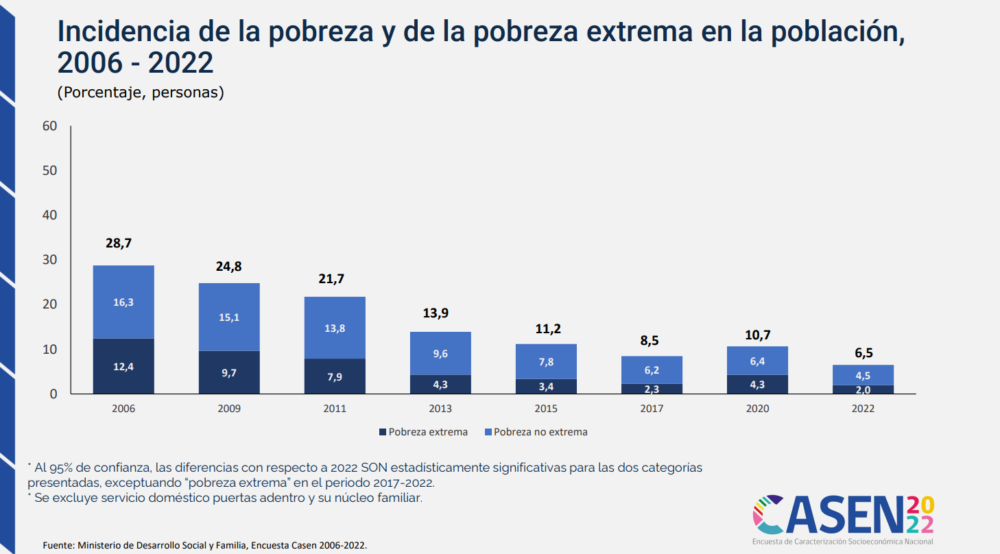

# Selección de artículo/reporte

- Observatorio Social. (2023). Encuesta Casen 2022. Ministerio de Desarrollo Social y Familia. https://observatorio.ministeriodesarrollosocial.gob.cl/encuesta-casen-2022
- La encuesta seleccionada corresponde a la encuesta CASEN realizada en el año 2022 por el Ministerio de Desarrollo Social y Familia. En ella se recopilan datos de diversos aspectos socioeconómicos de la población chilena, especialmente de grupos prioritarios y/o en situación de pobreza. Casen (2022) 
- La selección de este artículo se debe a ahondar en la reproductibilidad de los datos, análisis y graficos que se presentan en el informe de la encuesta CASEN 2022. En ella, se visualizan datos longitudinales en los que se muestra la evolución de la Indicencia de la pobreza y de la pobreza extrema en la población chilena, entre los años 2006 a 2022. 


# Evaluación de reproducibilidad


  -   **Disponibilidad de datos**: 
   El artículo proporciona el acceso a los documentos de la encuesta CASEN 2022, en donde se pueden encontrar los datos armonizados utilizados en el estudio. 
   El gráfico seleccionado comprende datos longitudinales de los años 2006, 2009, 2011, 2013, 2015, 2017, 2020 y 2022. Sin embargo, el link señalado en el artículo no comprende los datos del año 2020, y los datos del año 2006 no están armonizados para ser comparables con la metodología de 2013. 

  -   **Disponibilidad de código**: El artículo elegido no proporciona un acceso al código utilizado para el análisis. Sin embargo, al organizar una sesión de ayudantía con el profesor a cargo del electivo de Ciencia Social Abierta, se logró contactar con Dafne Jaime Vargas, quien actualmente trabaja en el Ministerio de Desarrollo Social de Chile, la cual a través de un correo nos dio información valiosa en torno a las bases de datos armonizadas de la encuesta CASEN 2022, construcción de indicadores y cómo replicar las salidas de resultados del Observatorio. Con lo anterior, se logró crear un código que refleja la limpieza necesaria de las bases de datos utilizadas (2009 – 2022) y el procesamiento de datos hasta el gráfico final replicado.

  -   **Documentación**: El artículo elegido para la reproducción de resultados cumple con su rol de difusión de resultados, pero no es suficiente como documento metodológico para la reproducción independiente. Para una replicación real desde las bases de datos se necesita obligatoriamente consultar las Notas Técnicas complementarias y el Libro de códigos de la base de datos pública de CASEN 2022 (y años anteriores), que están disponibles en el Observatorio Social del Ministerio, pero que no forman parte del artículo seleccionado.

  -   **Transparencia**: El artículo no especifica financiamiento, tampoco posibles conflictos de interés. Sin embargo, se transparentan las instituciones involucradas, así como también el panel de expertos y expertas. Además, se transparenta el proceso de producción en donde se señalan los aportes de los organismos al artículo.

# Análisis reproducible

## Resultado a reproducir

El gráfico a reproducir es el siguiente:

{#fig-original}


## Proceso de reproducción

### Procesamiento

Iniciamos cargando las librerias necesarias para realizar el procesamiento de datos.

```{r}
#| label: procesamiento-datos
#| eval: false
#| echo: true
library(haven)
library(dplyr)
library(srvyr)
library(ggplot2)

```

Con este codigo, lo que hacemos es evitar que el calculo de varianza falle en estratos pequeños.

```{r}
#| eval: false
#| echo: true
options(survey.lonely.psu = "adjust")
```

En esta parte creamos una función para estandarizar el proceso en todos los años de la serie

```{r}
#| eval: false
#| echo: true
calcular_pobreza_oficial <- function(ruta_dta, anio, v_ids = "varunit", v_strata = "varstrat") {
  
  cat("Procesando resultados oficiales año:", anio, "...\n")
  base <- read_dta(ruta_dta)
  

```


Acá comienza la limpieza y preparación de las variables. Acá se introduce un filtro el cual sirve para eliminar casos sin datos de pobreza o con factor de expansión cero.

```{r}
#| eval: false
#| echo: true
# limpieza estandar
  resultado <- base %>%
    filter(!is.na(pobreza_2013), !is.na(expr), expr > 0) %>%
    # filtro opcional: Solo si la variable de parentesco existe, excluimos servicio doméstico

```

En este punto hay una recodificación de las variables, ya que transformamos los códigos númericos en categorias descriptivas, conforme a la metodologia de 2013.

```{r}
#| eval: false
#| echo: true
# mutate(pobreza_cat = case_when(
      pobreza_2013 == 1 ~ "Pobreza extrema",
      pobreza_2013 == 2 ~ "Pobreza no extrema",
      pobreza_2013 == 3 ~ "No pobres",
      TRUE ~ NA_character_
    )) %>% 

```

Este es un paso importante, debido a que con él hacemos que los datos representen lo señalado por los encuestados en la encuesta.
Incorpora pesos (expr), conglomerados (ids), y estratificación (estrata)
```{r}
#| eval: false
#| echo: true
    as_survey_design(ids = !!sym(v_ids), strata = !!sym(v_strata), weights = expr, nest = TRUE) %>%

```

Acá calculamos la media ponderada (porcentaje) por categoría.

```{r}
#| eval: false
#| echo: true
group_by(pobreza_cat) %>%
    summarize(porcentaje = survey_mean(na.rm = TRUE) * 100) %>%
```

Finalizando este bloque, añadimos la columna de año para la unión final de la serie.
```{r}
#| eval: false
#| echo: true
 mutate(ano = as.character(anio))
  
  return(resultado)
}
```


Tras finalizar la limpieza y recodificación, se procesan las bases originales (.dta).
Acá, la base de datos de CASEN 2009 usa nombres de variables distintos (segmento/estrato)

```{r}
#| eval: false
#| echo: true
res_22 <- calcular_pobreza_oficial("input/data/original/casen_2022.dta", 2022)
res_17 <- calcular_pobreza_oficial("input/data/original/casen_2017.dta", 2017)
res_15 <- calcular_pobreza_oficial("input/data/original/casen_2015.dta", 2015)
res_13 <- calcular_pobreza_oficial("input/data/original/casen_2013.dta", 2013)
res_11 <- calcular_pobreza_oficial("input/data/original/casen_2011.dta", 2011)
res_09 <- calcular_pobreza_oficial("input/data/original/casen_2009.dta", 2009, "segmento", "estrato")
```

Unimos todos los años, filtramos a la población en pobreza y ordenamos los factores para el gráfico.

```{r}
#| eval: false
#| echo: true

tabla_final <- bind_rows(res_09, res_11, res_13, res_15, res_17, res_22) %>%
  filter(pobreza_cat != "No pobres") %>%
  mutate(pobreza_cat = factor(pobreza_cat, levels = c("Pobreza no extrema", "Pobreza extrema")))

```

Finalizando ya el apartado de procesamiento, hacemos el grafico con la tabla final y guardamos los resultados. Tambien se guardan los RDS para saltar la parte de limpieza y que simplemente salga el grafico con los resultados.
```{r}
#| eval: false
#| echo: true

ggplot(tabla_final, aes(x = ano, y = porcentaje, fill = pobreza_cat)) +
  geom_bar(stat = "identity", position = "stack", width = 0.7) +
  geom_text(aes(label = paste0(round(porcentaje, 1), "%")), 
            position = position_stack(vjust = 0.5), color = "white", fontface = "bold") +
  scale_fill_manual(values = c("Pobreza extrema" = "#003366", "Pobreza no extrema" = "#3399FF")) +
  theme_minimal() +
  labs(title = "Evolución de la Pobreza en Chile (2009-2022)", caption = "Fuente: Ministerio de Desarrollo Social y Familia")


ggsave("output/graphs/grafico_evolucion_pobreza.png", 
       width = 10, 
       height = 7, 
       dpi = 300)

#guardamos rds para evitar procesar todas las bases brutas

saveRDS(res_09, "input/data/proc/res_09.rds")
saveRDS(res_11, "input/data/proc/res_11.rds")
saveRDS(res_13, "input/data/proc/res_13.rds")
saveRDS(res_15, "input/data/proc/res_15.rds")
saveRDS(res_17, "input/data/proc/res_17.rds")
saveRDS(res_22, "input/data/proc/res_22.rds")

```


### Reproducción

Para la generación de grafico iniciamos cargando las librerias  y los rds ya guardados anteriormente.

```{r}
#| eval: true
#| echo: true

# Descomenta la siguiente línea si no tienes instalados los paquetes:
# install.packages(c("dplyr", "ggplot2"))

library(dplyr)
library(ggplot2)

# Cargar los resultados anteriormente procesados.
res_09 <- readRDS("input/data/proc/res_09.rds")
res_11 <- readRDS("input/data/proc/res_11.rds")
res_13 <- readRDS("input/data/proc/res_13.rds")
res_15 <- readRDS("input/data/proc/res_15.rds")
res_17 <- readRDS("input/data/proc/res_17.rds")
res_22 <- readRDS("input/data/proc/res_22.rds")

```

Una vez cargamos los datos, consolidamos nuevamente la tabla final hecha anteriormente y aplicamos la estetica para recrear el diseño del articulo original 

```{r}
#| eval: true
#| echo: true

tabla_final <- bind_rows(res_09, res_11, res_13, res_15, res_17, res_22) %>%
  filter(pobreza_cat != "No pobres") %>%
  mutate(pobreza_cat = factor(pobreza_cat, 
                              levels = c("Pobreza no extrema", "Pobreza extrema")))

#gráfico Final 
ggplot(tabla_final, aes(x = ano, y = porcentaje, fill = pobreza_cat)) +
  geom_bar(stat = "identity", position = "stack", width = 0.7) +
  # Etiquetas con el primer decimal oficial
  geom_text(aes(label = paste0(round(porcentaje, 1), "%")), 
            position = position_stack(vjust = 0.5), 
            color = "white", fontface = "bold", size = 3.5) +
  # Colores institucionales definidos por el equipo
  scale_fill_manual(values = c("Pobreza extrema" = "#003366", 
                               "Pobreza no extrema" = "#3399FF")) +
  labs(title = "Evolución de la Pobreza en Chile (2009-2022)",
       subtitle = "Porcentaje de personas en situación de pobreza por ingresos",
       x = "Año de la Encuesta Casen",
       y = "Porcentaje (%)",
       fill = "Categoría",
       caption = "Fuente: Elaboración propia basada en microdatos Casen (MDSF)") +
  theme_minimal() +
  theme(legend.position = "bottom", plot.title = element_text(face = "bold"))
```


# Conclusiones

Tras el analisis realizado, se concluye que articulo presenta un nivel de reproducibilidad medio-alto, ya que si bien los datos de la encuesta casen son de acceso público, la falta de los scripts originales impone una carga elevada para el investigador independiente.
Se logró una replica exacta de la serie historica de pobreza (2009-2022) exceptuando el año 2006 debido a que no son compatibles con la nueva metodología de la CASEN, y el año 2020, ya que no tenemos acceso a la base armonizada. 
Para finalizar, el uso de herramientas como Rstudio y VS Code, junto con la optimización de los datos en formato .rds fueron de suma importancia para superar barreras del hardware al cargar datos de gran volumen. 

# Recomendaciones

- Transparentar el financiamiento del proyecto, señalando las fuentes de financiamiento y su posible influencia en los resultados. 
- Señalar posibles conflictos de interés que puedan existir entre los autores y las instituciones involucradas, para garantizar la transparencia y la confianza en los resultados presentados.
- Proporcionar datos armonizados de los años 2006 y 2020.
- Realizar notas técnicas en donde se especifiquen los cambios metodológicos de años anteriores con tal de replicar resultados (en el artículo solo se menciona el cambio metodológico del año 2022).
- Publicar el código utilizado para la creación de tablas y gráficos  
  (de orden comparativo o no).


# Referencias

::: {#refs}
Observatorio Social. (2023). Encuesta Casen 2022. Ministerio de Desarrollo Social y Familia. https://observatorio.ministeriodesarrollosocial.gob.cl/encuesta-casen-2022 
:::

# Apéndice

## Material suplementario

Nota sobre el uso de IA: Este proyecto integró el uso de IA para la asistencia en la programación en Rstudio. La herramienta permitió agilizar  el tratamiento de microdatos y asegurar la corrercta renderización del archivo final en VS Code.

## Código


